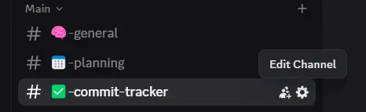

# 🍼 Commit Formatter Bot

<p align="center">
  
</p>

<p align="center">
  A tiny helper bot that lives in your Discord server and makes commit messages adorable 🧸 <br>
  It listens for GitHub push events and posts cute little formatted updates in your channel 💬✨
</p>

---

## 💡 What It Does

When someone pushes to GitHub:

```
🔨 [Bryen] pushed [`abc1234`](https://github.com/user/repo/commit/abc1234): `Update readme and fix styles`
```

The bot posts that to your server using a WebHook — no bot login needed!

---

## 🛠 Usage

1. Go to your Discord server and open **channel settings**
2. Go to **Integrations → Webhooks → New Webhook**
3. Name it: `Commit Formatter Bot`
4. Set the **channel** and **copy the WebHook URL**
5. In your `.env` file:

```env
DISCORD_WEBHOOK_URL=https://discord.com/api/webhooks/your_webhook_url
```

6. Deploy the bot to Render or run locally with:

```bash
npm install
npm start
```

---

## 📸 Demo

<p align="center">
  
</p>

---

## 🌐 Hosted on Render

> `https://discord-webhook-bot.onrender.com`

---

<p align="center">
  Made with ❤️ by <strong>BryGuy</strong>
</p>
