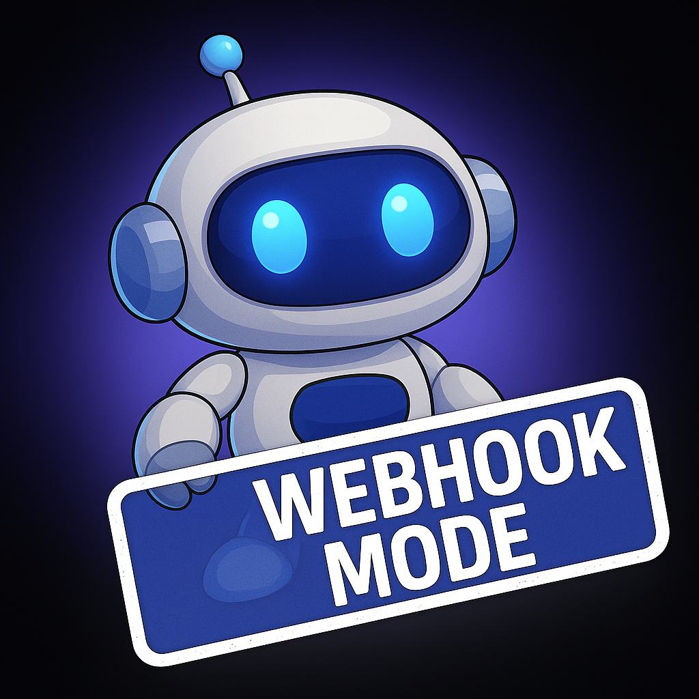

# 🪝 Captain Hook: WebHook Bot

<p align="center">
  
</p>

<p align="center">
  A lightweight Discord bot that listens for GitHub push events and posts clean, formatted commit messages directly to your server via WebHook.
</p>

---

## 💡 What It Does

When someone pushes to GitHub:

```
🪝 PHTMGatt pushed: Update readme and fix styles
```

Captain Hook formats the commit and sends it to your selected Discord channel — no bot login or token required.

---

## ⚙️ Setup Instructions

### 1. Create a WebHook in Discord

1. Open your server and go to the desired **channel**
2. Click the ⚙️ **Channel Settings** → **Integrations → Webhooks**
3. Click **New Webhook** and copy the generated **Webhook URL**

---

### 2. Add the WebHook URL to your `.env`

```env
DISCORD_WEBHOOK_URL=https://discord.com/api/webhooks/your_webhook_url
```

---

### 3. Deploy the Bot

Run locally:
```bash
npm install
npm start
```

Or deploy to Render using your preferred build steps.

---

## 📸 Demo

<p align="center">
  
</p>

---

## 🌐 Live Endpoint (Render)

> `https://discord-webhook-bot-1f23.onrender.com`

Use this as the **GitHub Webhook URL**:
```
https://discord-webhook-bot-1f23.onrender.com/github
```

---

<p align="center">
  Made with 🧠 and ⚙️ by <strong>BryGuy</strong>
</p>
